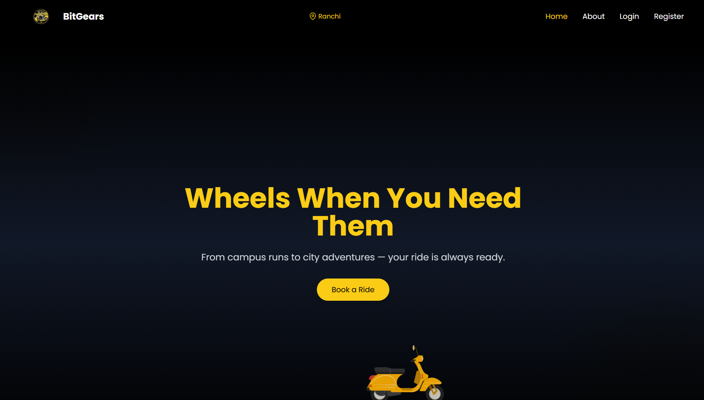
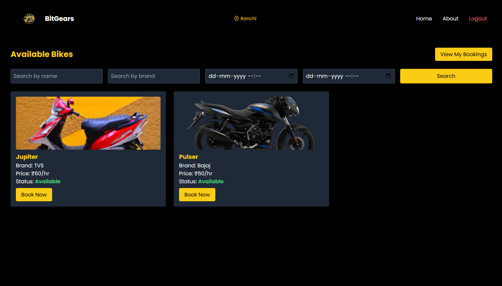
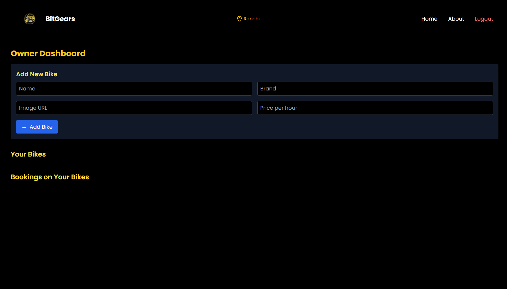
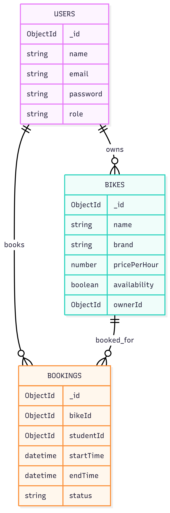
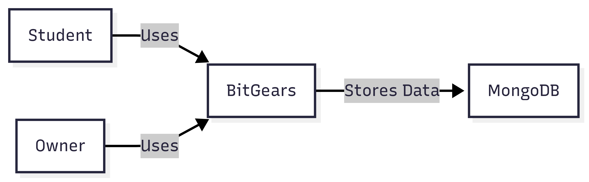
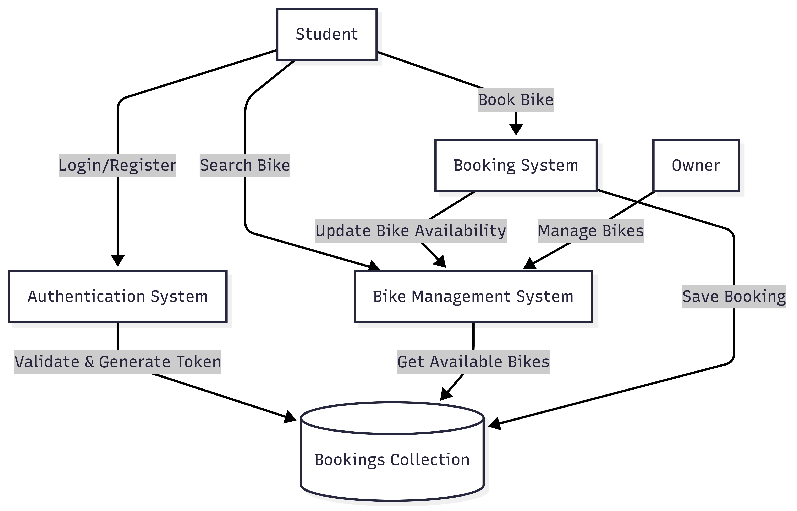
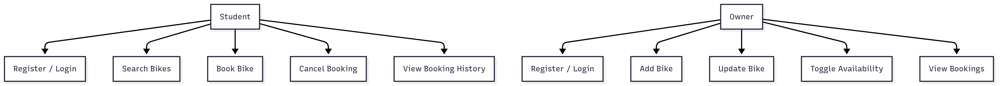
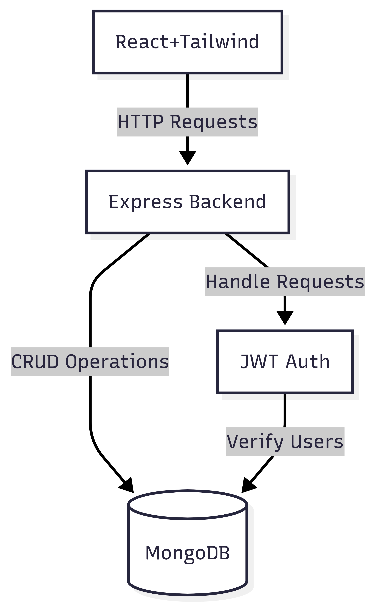
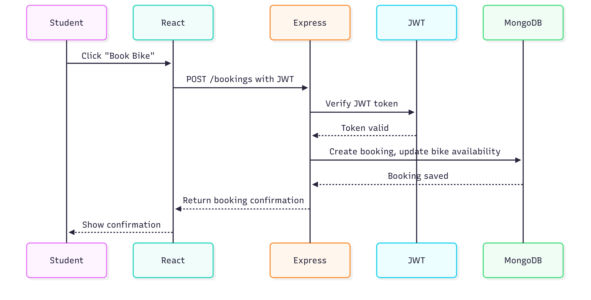
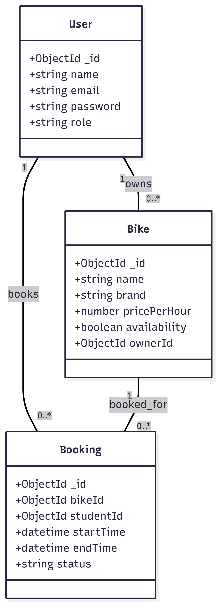

# BitGears – Bike Rental Platform

## Project Overview
BitGears is a full-stack bike rental platform that allows students to rent bikes from owners on an hourly basis. The platform handles bike listings, bookings, and user management securely and efficiently. It is built with React, Tailwind CSS, Express.js, Node.js, and MongoDB.

## Features
- **User Roles**: Student & Owner
- **Student Features**:
  - Register/Login
  - Search available bikes
  - Book or cancel bikes
  - View booking history
- **Owner Features**:
  - Register/Login
  - Add or update bikes
  - Toggle bike availability
  - View bookings
- **Authentication & Security**: JWT-based authentication to protect sensitive routes.
- **Booking Management**: Ensures bike availability updates and proper CRUD handling.

## Tech Stack
| Layer       | Technology               |
|------------|--------------------------|
| Frontend   | React, Tailwind CSS      |
| Backend    | Node.js, Express.js      |
| Database   | MongoDB Atlas            |
| Auth       | JWT (JSON Web Tokens)    |
| Deployment | Render                   |

## Live Demo
Check out the live project here: [BitGears Live](https://bitgears.onrender.com/)

## Demo Video
[](https://youtu.be/kWvWQc3VlfU?si=TVShG5QIwjwkd6b6)

## Screenshots

### Homepage


### Student Dashboard


### Owner Dashboard


## System Design & Diagrams

### ER Diagram


### Level 0 DFD


### Level 1 DFD


### Use Case Diagram


### System Architecture


### Sequence Diagram


### Class Diagram



## How It Works
1. **Frontend (React + Tailwind)**: Provides an interactive UI for Students and Owners.
2. **Backend (Express + Node.js)**: Handles all API requests, authentication, and CRUD operations.
3. **Database (MongoDB)**: Stores Users, Bikes, and Bookings.
4. **JWT Authentication**: Secures routes and ensures only authorized users can perform actions.
5. **Booking Flow**: Student logs in → searches bike → books → backend updates DB → confirmation shown.

## Getting Started
1. **Clone the repo:**
```bash
git clone <https://github.com/AnkkitSeth/bitgears>
```
2. **Install backend dependencies:**
```bash
cd backend
npm install
```
3. **Start backend server:**
```bash
npm start
```
4. **Frontend is served from the backend’s build folder (already configured in this project).**

5. **Open the app in your browser at http://localhost:<port>.**

## Future Enhancements
- Payment integration for online bookings
- Rating and review system for bikes and owners
- Admin dashboard for monitoring users and bookings

## Conclusion
BitGears is a user-friendly, full-stack bike rental platform built with modern technologies, complete with secure authentication, role-based dashboards, and a structured database design. The project demonstrates end-to-end development from frontend to backend, including system design and deployment.

## Author
**Ankkit Seth** – Full Stack Developer  
Portfolio: [ankkit.site](https://ankkit.site)  
GitHub: [github.com/AnkkitSeth](https://github.com/AnkkitSeth)  
LinkedIn: [linkedin.com/in/ankkit-seth-495182237/](https://www.linkedin.com/in/ankkit-seth-495182237/)  
Email: ankkitseth@gmail.com  

Passionate about web development, building full-stack applications, and exploring new technologies.

